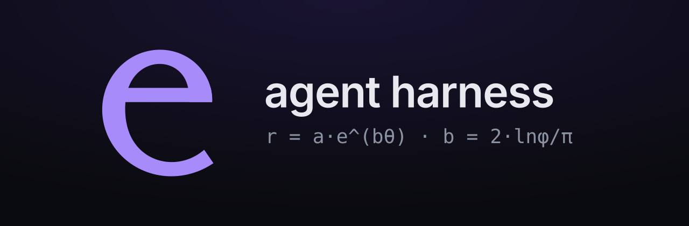
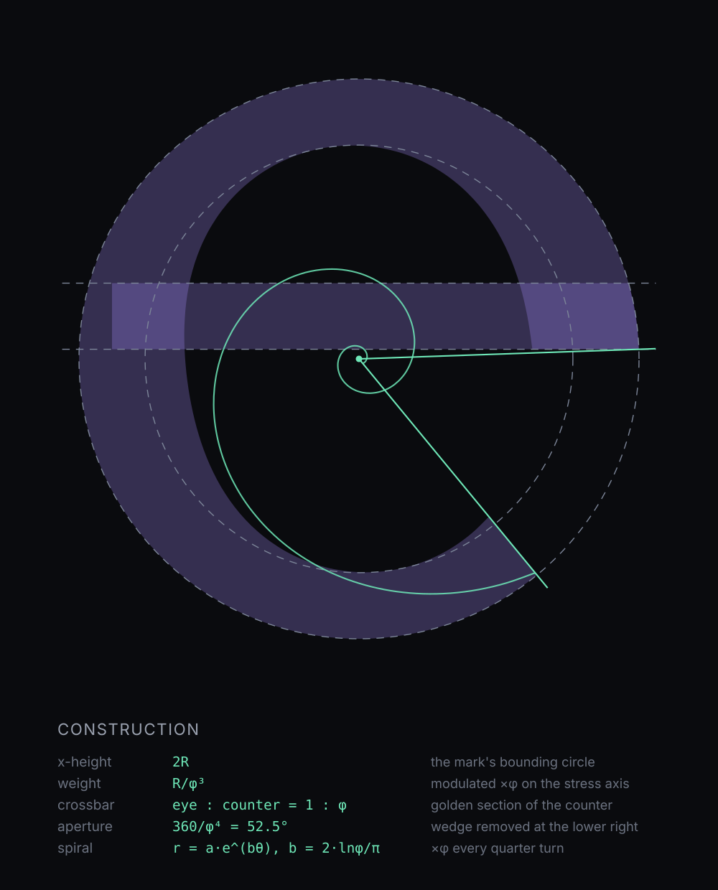

# e

<p align="center">
  
</p>

**e** is a minimalist, fast, extensible **agent harness** with a native GUI —
the inner loop of an agent coding tool (converse → call tools → apply → repeat)
without the terminal. A slim Rust core drives the agent and its tools; a tiny
hand-tuned webview renders the conversation.

Built on **Tauri v2** (Rust + the OS WebView) with a vanilla TypeScript
frontend. No Electron, no framework — the whole renderer is ~20 KB.

```
.______________________________.
|  e                      4 tools  ⟂ ⚙  gpt-4.1-mini |
|                — — — — — — — — —             |
|   ▸ you                                        |
|   What can we ship?                            |
|                                                |
|   ▸ e                                          |
|   Reading the repo…                            |
|   [list_dir]  [read_file]  [shell]             |
|   ┌──────────────────────────────────────┐    |
|   │ Ask e to do something…          (➤)   │    |
|   └──────────────────────────────────────┘    |
'______________________________'
```

## What it does

- **A real harness, not a wrapper.** The model calls tools — shell, read/write
  files, list dir — and the results feed back until the task is done, bounded to
  25 steps and cancellable with **Esc**.
- **Any OpenAI-compatible provider.** OpenAI, Ollama, LM Studio, vLLM, Together,
  OpenRouter, or your own gateway. Keep several at once and switch per chat.
- **Chats and projects.** Conversations persist, fork, and carry their own model,
  workspace and token budget. History is summarised automatically when a chat
  approaches its model's context window.
- **Streaming everything.** Tokens, reasoning, tool cards, and live token and
  cost counters as the run happens.
- **Extensible.** Add a tool by implementing one trait — see
  [Add a tool](#add-a-tool) below.
- **Yours.** Keys and settings live in `~/.e/config.json`, never in the repo.

## Install

Prerequisites: Node.js ≥ 18, Rust (stable), and your platform's
[Tauri prerequisites](https://tauri.app/start/prerequisites/) (on Windows:
WebView2 runtime + MSVC toolchain).

```bash
npm install
npm run tauri dev        # dev server + native window, hot reload
npm run tauri build      # single native executable in src-tauri/target/release/
```

## First run

`e` ships with **no provider configured**. Open **Settings (⚙)** and add one:

1. **+ Add provider** — give it a name, a base URL (e.g.
   `https://api.openai.com/v1`, or `http://localhost:11434/v1` for Ollama) and a
   key if it needs one.
2. **Refresh** pulls the model list from `<base_url>/models`, or add model ids by
   hand for gateways that don't list everything they serve.
3. Pick a model from the title bar. A model carries its provider with it, so
   choosing one selects the base URL, key and context window too.

Environment variables override the active provider for a launch: `E_BASE_URL`,
`E_API_KEY`, `E_MODEL`, `E_WORKSPACE`.

## Built-in tools

| tool         | purpose                                        |
|--------------|------------------------------------------------|
| `shell`      | run a command in the workspace (120 s timeout)  |
| `read_file`  | read a text file (truncated if huge)            |
| `write_file` | write a file, creating parents                  |
| `list_dir`   | list a directory                                |
| `skills`     | load a `SKILL.md` on demand                     |

The **workspace** — where `shell` runs and relative paths resolve — belongs to
the chat's project and is set in the sidebar (✎).

## Add a tool

A tool is a struct implementing one trait. Here is a complete, working one:

```rust
// src-tauri/src/engine/tools.rs
use serde_json::{json, Value};

pub struct GitStatusTool;

impl Tool for GitStatusTool {
    fn name(&self) -> &str {
        "git_status"
    }

    fn description(&self) -> &str {
        "Show the working tree status of the workspace's git repository."
    }

    /// JSON Schema for `arguments`. This is what the model is shown.
    fn parameters(&self) -> Value {
        json!({
            "type": "object",
            "properties": {
                "short": { "type": "boolean", "description": "Use --short output." }
            }
        })
    }

    fn run(&self, ctx: &ToolContext, args: Value) -> ToolResult {
        let short = args.get("short").and_then(|s| s.as_bool()).unwrap_or(true);

        let mut cmd = std::process::Command::new("git");
        cmd.current_dir(ctx.dir()?).arg("status");
        if short {
            cmd.arg("--short");
        }

        let out = cmd.output().map_err(|e| format!("git: {e}"))?;
        if !out.status.success() {
            return Err(String::from_utf8_lossy(&out.stderr).trim().to_string());
        }
        Ok(String::from_utf8_lossy(&out.stdout).to_string())
    }
}
```

Register it in `ToolRegistry::new()`:

```rust
r.register(GitStatusTool);
```

That is the whole surface. `parameters()` is sent to the model, `run()` receives
whatever the model passed, and the returned `Ok`/`Err` string is fed back into
the conversation — the agent loop, the tool card in the UI, and the approval
prompt all work automatically.

Two things worth knowing:

- `ctx.dir()?` resolves the chat's workspace and returns a readable error if it
  is unset or missing, so a tool never runs somewhere unexpected.
- `run()` is synchronous and runs on a worker thread. For anything long-running,
  apply your own timeout (the `shell` tool uses `mpsc::recv_timeout`).

## Documentation

| doc | what's in it |
|-----|--------------|
| [EXTENDING.md](docs/EXTENDING.md) | adding tools, providers, skills, plugins; the headless RPC binary |
| [ARCHITECTURE.md](docs/ARCHITECTURE.md) | how the core and its four extension surfaces fit together |
| [DESIGN.md](docs/DESIGN.md) | design tokens, themes, layout and typography |
| [ROADMAP.md](docs/ROADMAP.md) | what's shipped, what's planned, what's deliberately out of scope |

## How it works

```
Tauri frontend (TypeScript)          Rust core (src-tauri/src)
────────────────────────────         ──────────────────────────
  composer ──send_text()──▶            engine::agent::Agent.run()
  streaming tokens ◀─e:token──        engine::provider  (OpenAI-compatible, SSE)
  tool cards     ◀─e:tool_call──      engine::tools     (registry + built-ins)
  tool results   ◀─e:tool_result──    loop: model → run tools → model …
  done           ◀─e:done──
```

The engine owns a `Vec<Msg>` conversation, calls the provider, executes any
requested tools, injects the results, and repeats until the model stops
requesting tools.

```
src-tauri/src/
  main.rs            desktop entry point
  lib.rs             Tauri app, commands, event bridge
  engine/
    mod.rs           message/tool-call model + Emitter trait
    provider.rs      OpenAI-compatible streaming client
    tools.rs         Tool trait, registry, built-in tools
    agent.rs         config + the agent loop
    sessions.rs      chats, projects, persistence
    skills.rs        SKILL.md discovery
    mcp.rs           MCP client
    plugins.rs       drop-in TypeScript plugins
src/
  main.ts            UI controller
  api.ts             typed bridge to the Rust backend
  markdown.ts        tiny XSS-safe markdown renderer
  copy.ts            copy-to-clipboard buttons
  style.css          all styling
```

## Configuration

Settings live in `~/.e/config.json` and are written by the GUI — edit by hand
only if you want to.

```jsonc
{
  "temperature": 0.7,
  "system": "You are e, a fast, capable agent…",
  "workspace": "C:/src/work",
  "model": "gpt-4.1-mini",     // the picked model…
  "provider_id": "openai",     // …and who serves it
  "providers": [
    {
      "id": "openai",
      "name": "OpenAI",
      "base_url": "https://api.openai.com/v1",
      "api_key": "",              // or set E_API_KEY
      "enabled": true,            // off hides its models but keeps the key
      "context_window": null,     // provider-wide fallback; null = global
      "models": ["gpt-4.1-mini", "gpt-4.1"],
      "model_meta": {             // per model: learned on Refresh, tuned by you
        "gpt-4.1": {
          "advertised_window": 272000,   // what /models said
          "window_override": null,       // your number; beats the above
          "reasoning": true,             // takes a reasoning level
          "reasoning_efforts": ["low", "medium", "high"],
          "reasoning_effort": "high"     // the level to ask for
        }
      },
      "disabled_models": ["gpt-4.1"]     // hidden from the picker
    },
    {
      "id": "ollama",
      "name": "Ollama",
      "base_url": "http://localhost:11434/v1",
      "api_key": "",
      "enabled": true,
      "models": ["qwen3-coder:30b"],
      "disabled_models": []
    }
  ]
}
```

Top-level `base_url`, `api_key` and `models` are derived — the connection `e`
uses is always the one belonging to the provider serving the selected model.

**Context window** resolves per model, then the provider's fallback, then the
global default; it is what compaction is budgeted against. **Reasoning level**
is `auto · min · low · med · high`, or exactly the levels the provider
enumerated — `auto` sends no `reasoning_effort` field at all.

## Brand

<p align="center">
  
</p>

The mark is a lowercase **e** whose bowl is a true logarithmic spiral,
`r(θ) = r₀·e^(bθ)`, tuned so the radius grows by exactly φ across the sweep. It
is generated, not drawn: [`design/logo.py`](design/logo.py) emits every asset
from the same equations.

```bash
python design/logo.py            # writes design/brand/* and public/e.svg
python design/logo.py --review   # contact sheet of the alternate cuts
npm run tauri -- icon design/brand/e-tile.svg   # platform icon set
```

`public/e.svg` is the single source of truth for the in-app mark: the title bar
and empty state tint it with a CSS mask, so it follows the theme for free.
